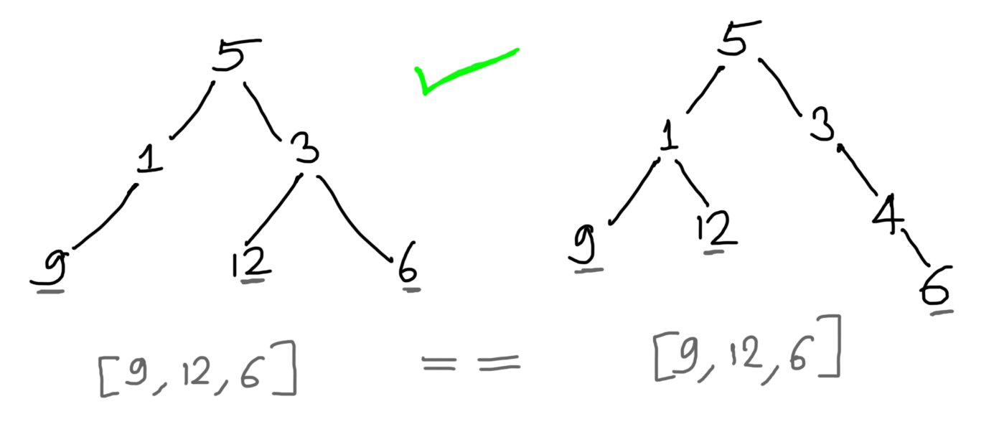
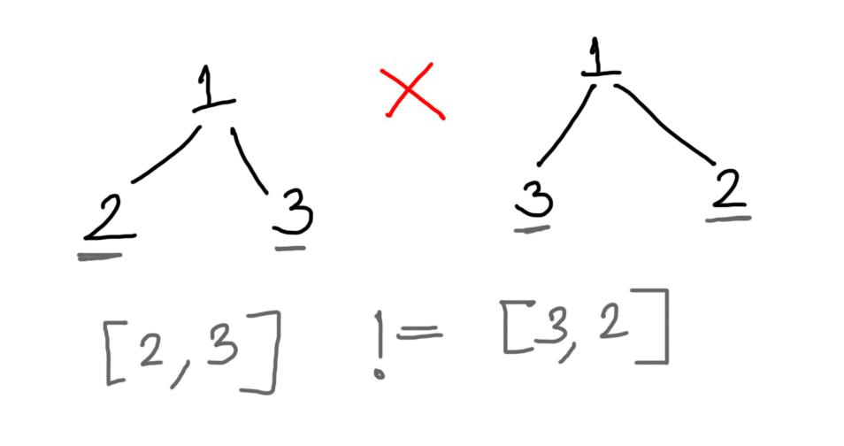

# Mock Interview - Lab 3
### Problems

1. You are given two binary trees. You have to find out if the leaves of these two trees form a similar sequence.  For example, consider following examples 

> Example 1 

> Example 2 

